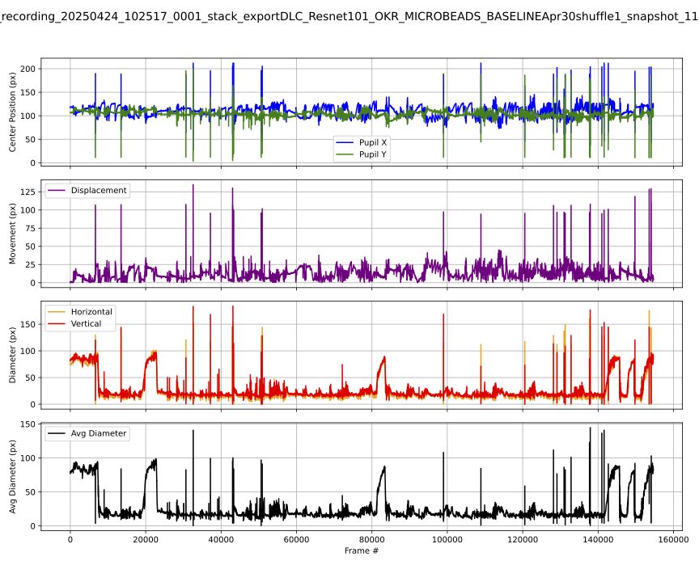

# DeepLabCut Eye Tracking & OKR Analysis

A computer vision and deep-learning workflow for tracking mouse eye movements and pupil dynamics during optokinetic response (OKR) experiments.

This project uses **DeepLabCut** for markerless pose estimation and provides Python tools for model training, video analysis, tracking-quality assessment, retraining, keypoint processing, and quantitative analysis of eye movement and pupil diameter.

## Overview

Quantifying eye movements from experimental video can require substantial manual processing. This project develops an automated workflow for extracting eye-position and pupil measurements from video using deep-learning-based pose estimation.

The overall workflow is:

**Experimental video → DeepLabCut pose estimation → landmark coordinates & confidence scores → quality control → pupil position & geometry → eye-movement metrics → quantitative visualization**

## Key Features

* Train and evaluate DeepLabCut models
* Analyze experimental videos using trained networks
* Generate labeled videos for visual validation
* Identify frames containing missing or low-confidence labels
* Extract problematic frames for additional training
* Reanalyze videos after model improvement
* Extract DeepLabCut keypoints from HDF5 output
* Quantify eye movement and pupil diameter
* Generate summary visualizations across experiments
* Manage analysis and retraining workflows through Python utilities and GUI tools

## Analysis Workflow

### 1. Model Training

DeepLabCut models are trained on manually labeled frames to identify anatomical landmarks used for eye tracking.

The training workflow supports model evaluation and iterative improvement of pose-estimation accuracy.

### 2. Video Analysis

Trained models are applied to experimental videos to generate frame-by-frame keypoint coordinates and confidence estimates.

### 3. Quality Control

Tracking results can be inspected through labeled videos and confidence information.

Frames containing missing or unreliable detections can be identified and extracted for additional labeling and model retraining.

### 4. Keypoint Processing

DeepLabCut output is processed to obtain the coordinates required for quantitative eye tracking.

### 5. Eye Movement and Pupil Analysis

Tracked landmarks are used to calculate and visualize measurements including:

* eye movement
* pupil position
* pupil diameter
* changes in these measurements across experimental recordings

### 6. Visualization

The pipeline generates plots summarizing eye movement and pupil measurements for individual recordings and groups of recordings.

## Repository Contents

Some of the primary scripts include:

* `train_evaluate_analyze_label_dlc.py` — model training, evaluation, video analysis, and labeling workflow
* `analyze_videos_dlc.py` — DeepLabCut video analysis
* `analyze_and_label_videos.py` — video analysis and labeled-video generation
* `extract_frames_with_missing_labels.py` — identifies problematic frames for model improvement
* `add_missed_frames_to_training.py` — incorporates additional frames into the training workflow
* `h5_keypoints.py` — processes DeepLabCut HDF5 keypoint output
* `plot_eye_movement_and_diameter_single.py` — visualization for individual recordings
* `plot_eye_movement_and_diameter_all.py` — summary visualization across recordings
* `dlc_manager.py` — workflow-management utilities
* `dlc_gui_tkinter.py` — graphical interface for DeepLabCut workflow operations
* `model_cleanup_preserve_labels.py` — model/project cleanup while preserving labeled data

## Technologies

**Python · DeepLabCut · PyTorch · NumPy · pandas · Matplotlib · HDF5 · Tkinter · Computer Vision**

## Applications

This workflow was developed for quantitative analysis of mouse eye movements during visual-response experiments, but the general approach can be adapted to other behavioral experiments requiring markerless tracking and quantitative analysis of anatomical landmarks.

## Example Output

The pipeline produces quantitative visualizations of eye position, movement, and pupil geometry from DeepLabCut tracking results.



Abrupt excursions in the traces can indicate low-confidence or erroneous landmark detections, motivating the pipeline's quality-control, problematic-frame extraction, and iterative retraining steps.

### Measurements shown

- **Pupil center position (X/Y):** tracks the estimated pupil center across video frames.
- **Eye movement / displacement:** quantifies frame-to-frame changes in pupil position.
- **Horizontal and vertical pupil diameter:** measures pupil geometry from tracked landmarks.
- **Average pupil diameter:** summarizes pupil size across the recording.

These measurements provide a quantitative representation of eye movement and pupil dynamics derived from pose-estimation output and can be used for downstream analysis of optokinetic responses and experimental conditions.
## Installation

Install the Python dependencies with:

```bash
pip install -r requirements.txt
```

DeepLabCut installation and GPU configuration may depend on the operating system, CUDA environment, and DeepLabCut version being used.

## Project Goals

This project demonstrates the integration of:

* deep learning
* computer vision
* behavioral neuroscience
* automated data processing
* model quality control
* scientific visualization

into a reproducible workflow for quantitative experimental analysis.
